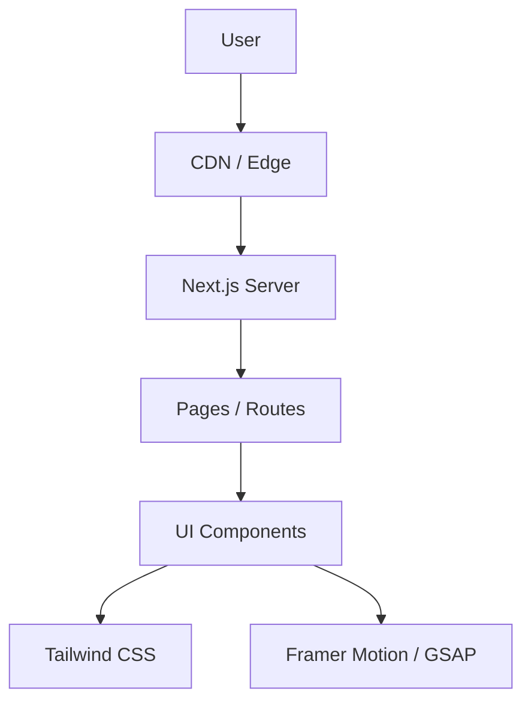

# Architecture

> Auto-generated by /map on 2026-02-14

## Overview

Instituto Frisoli is a premium medical institute website built with Next.js 16. It serves as an informational platform showcasing services, specialties, and the clinical team. The architecture is a modern, server-side rendered (SSR) React application using the Next.js App Router.

## Components

### `src/app`
- **Purpose**: App Router file-system based routing.
- **Location**: `src/app`
- **Key Routes**:
    - `/` (Home)
    - `/instituto`
    - `/especialidades`
    - `/equipe`
    - `/atendimento`
    - `/concierge`
    - `/contato`

### `src/components`
- **Purpose**: Reusable UI building blocks.
- **Location**: `src/components`
- **Structure**: Likely organized by atomic design or feature-based (found `sections` folder in previous context).

### `src/lib`
- **Purpose**: Utility functions and shared logic.
- **Location**: `src/lib`
- **Contents**: `utils.ts` (helper functions), `icons.ts`.

## Data Flow

Data appears to be primarily static or hardcoded within components/content files, given the absence of an API layer or external data fetching patterns found in the scan.

1.  **Request**: User requests a page.
2.  **Rendering**: Next.js renders the page on the server (SSR) or serves statically generated content (SSG).
3.  **Interaction**: Client-side interactivity is handled by React, utilizing Framer Motion and GSAP for animations.

## Technical Debt

- [ ] **No explicit data fetching layer**: Content seems hardcoded, which might be hard to maintain as the site grows.
- [ ] **Accessibility**: Needs verification (no explicit findings, but standard check).
- [ ] **Testing**: No test suite detected (`tests` or `__tests__` directories missing in root/src).

## Conventions

- **Styling**: Tailwind CSS (`@tailwindcss/postcss`).
- **Icons**: `lucide-react`.
- **Fonts**: `@fontsource/*` packages.
- **Animations**: Mixed usage of `framer-motion` and `gsap`.
